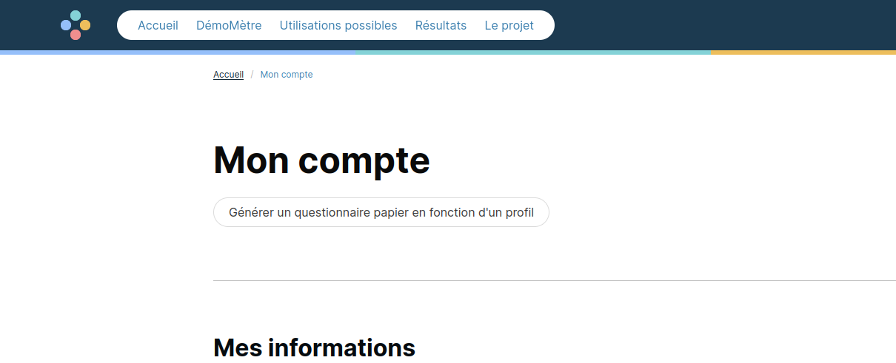
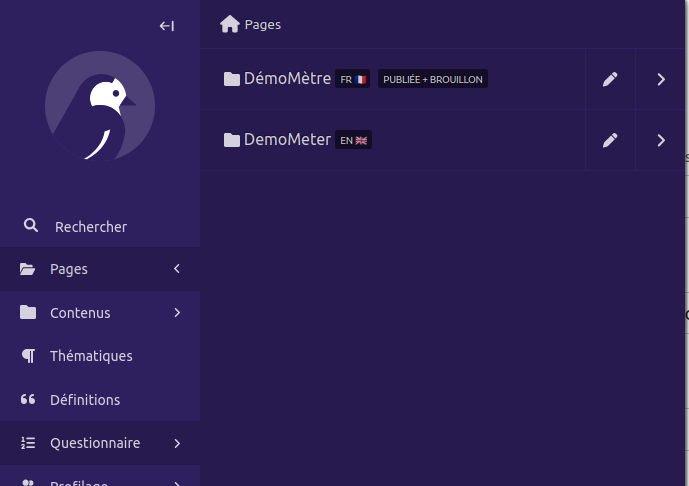
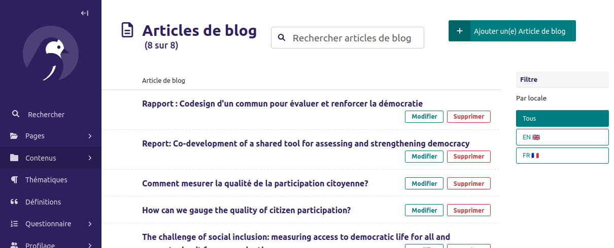

# Démomètre

## Documentation pour développeurs

[Documentation front-end](front/README.md)

[Documentation back-end](back/README.md)

## Documentation pour humains

[Documentation des tests d'intégration](front/cypress/README.md)

[Éléments de documentation technique à destination de Démocratie Ouverte](https://docs.google.com/document/d/1gxbE-jc1jgo6TjsCxgWjgNBIH2bfUEvHKVm4Xmb4Aso/edit?tab=t.0)

### Questionnaire papier

Note : seuls les utilisateurs administrateurs ou experts peuvent générer un questionnaire papier.

Pour cela, une fois connecté, se rendre dans la page Mon Compte.

Il suffit alors de cliquer sur le bouton "Générer un questionnaire papier en fonction d'un profil",
puis de choisir le profil. On arrive alors sur une page affichant toutes les questions en précisant
les profils concernés.

La page peut alors être imprimée avec le navigateur.

### Ateliers et saisir des résponses papier

En tant qu'initiateur d'une évalution, on peut ajouter des ateliers.

Depuis la page d'une évaluation (Mon Compte -> Évaluations -> Mon évaluation), une rubrique
"Mes ateliers" est présente. On peut ajouter ou modifier des ateliers.

Depuis la page d'un atelier (cliquer dessus depuis la liste pour y accéder), on peut modifier les
informations et saisir des réponses papier.

Pour saisir des réponses papier, il faut d'abord saisir des participants, et indiquer donc qu'ils
ont répondu "Sur papier".

Une fois les participants saisis, cliquer sur "Saisir les réponses papier". On peut répondre ensuite
à chaque question, une fois par participant.

### Traduction

#### Éléments traduisibles dans l'interface d'administration

##### Questionnaire

Pour les éléments du questionnaire (Pillier / Marqueur / Critère / Question),
tous les textes présents sont présents dans toutes les langues, les un en-dessous des autres.

Par exemple ici, pour l'énoncé de la question :

C'est ailleurs dans le menu, mais cela fonctionne de la même manière pour les
rôles / type de profil / question de profilage / retour d'expérience / ressource.

##### Pages du site

Les pages du sites sont structuré de manière hiérarchique, la page "parent" principale étant la page d'accueil de la langue correspondant.

Pour modifier la page d'accueil de la langue, cliquer sur le 🖊️ crayon à droite.
Pour visualiser les pages enfants, cliquer sur la flèche à droite.

Les pages "enfants" peuvent ensuite être modifiés en cliquant aussi sur le crayon 🖊️.

##### Articles de blog

Les articles sont indépendants dans chaque langue. On peut créer un article uniquement en anglais,
ou uniquement en français, ou un article équivalent dans les deux langues.

Pour n'afficher que les articles dans une langue, un filtre existe sur la droite.

#### Éléments web traduisibles par fichier de traduction

De nombreux éléments web ne sont pas traduisibles dans l'interface d'administration,
par exemple les boutons de navigation, du bas de page, des boutons "suivant" ou "précédent"...

Au départ, ils étaient traduisibles dans une interface en ligne, sur [POEditor](https://poeditor.com/).

Le logiciel étant payant, ce n'est plus possible en ligne. Les modifications sont maintenant faites
par les développeurs sur [ce fichier](back/locale/en/LC_MESSAGES/django.po).
Des demandes de modification peuvent être faites aux développeureuses.

#### Ajouter une nouvelle langue

Ajouter une nouvelle langue demande une intervention de la part des développeureuse,
de l'ordre d'une journée de travail.
Cf [Documentation back-end](back/README.md#ajouter-une-langue) pour la partie technique.
