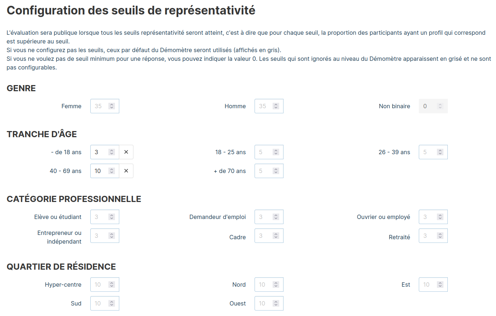
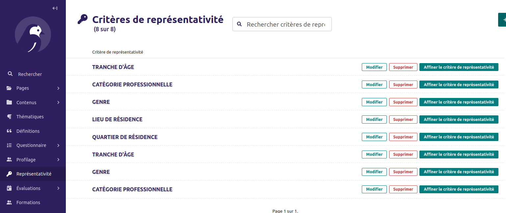
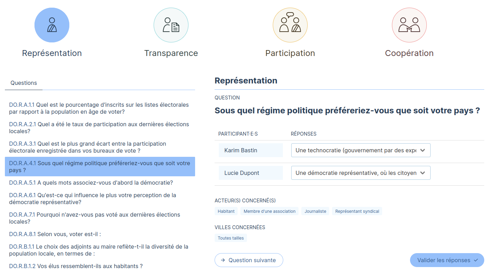

# Démomètre

## Documentation pour développeurs

[Documentation front-end](front/README.md)

[Documentation back-end](back/README.md)

## Documentation pour humains

[Documentation des tests d'intégration](front/cypress/README.md)

[Éléments de documentation technique à destination de Démocratie Ouverte](https://docs.google.com/document/d/1gxbE-jc1jgo6TjsCxgWjgNBIH2bfUEvHKVm4Xmb4Aso/edit?tab=t.0)

### Cycle de vie d'une évaluation et évaluations multiples par ville

Il existe trois types d'évaluation :

- évaluation participative, avec ou sans expert
- évaluation rapide

Pour les évaluations participatives, une seule évaluation peut être fait par collectivité en même temps.
Concrètement, si l'utilisateur U1 initie une évaluation sur la ville de Paris, un utilisateur U2 ne peut que rejoindre l'évaluation initiée par U1.

Les évaluations rapides sont faites par et pour un utilisateur uniquement. Elles n'impactent donc pas
les autres évaluations d'autres utilisateurs.

Attention tout de même : si une évaluation participative est en cours pour une ville, il n'est plus possible d'y lancer une évaluation rapide.
Dans l'autre sens, il est donc par contre possible de lancer une évaluation participative pour une
collectivité qui a déjà une ou plusieurs évaluations rapides effectuées.

Une évaluation est considérée en cours jusqu'à ce qu'elle soit clôturée.

Une évaluation peut être clôturée par un expert ou par l'initiateur.

### Process participatifs

#### Définir les process participatifs

Auparavant, pour les questions qui concernaient les process participatifs, il était difficile
d'interpréter les réponses s'il y avait plusieurs process participatifs pour la ville. Ça posait
également des questions pour les participants : comment dois-je répondre à la question de savoir
si j'ai été écouté lors des process participatifs si j'ai participé à plusieurs et que j'ai
des avis différents ?

Lors de l'initiation d'une évaluation (et uniquement lors de l'évaluation), il est maintenant possible de définir des process participatifs pour la collectivité évaluée. Les process participatifs sont associées à des catégories process participatifs, qui sont les réponses possibles à la Question dont le code est
"7A".

Si des process participatifs sont définis pour une évaluation, les participants peuvent indiquer les
process auxquels iels ont participé lors des questions de profilage.

#### Les questions qui concernent les process participatifs

Dans l'admin, on peut définir les questions qui concernent les process participatifs, en cochant
simplement la case correspondantes dans l'édition des questions.

En tant que participant, quand je réponds aux questions, si une questions concerne un process
participatif et que j'ai indiqué avoir participé à plusieurs process participatifs, je réponds
alors plusieurs fois à la question, une fois par process participatif.

Lorsque je visualise les résultats, je peux sélectionner le ou les process participatifs pour
lesquels je souhaite visualiser les résultats.

### Seuils de représentativité

Les seuils de représentativité servent à déterminer quand une évaluation peut être publiée : c'est le cas lorsque tous les seuils de représentativité sont respectés.

Par exemple, si j'ai configuré pour le seuil de représentativité "Genre" 35% pour Femme et 35% pour Homme, l'évaluation ne peut être publiée que si au moins 35% des participants ont répondu Femme à la question de profilage ET que au moins 35% des participants ont répondu Homme à la question de profilage.

#### Modifier les seuils pour une évaluation

Ces seuils peuvent être configuré par l'initiateur, dans la page d'une évaluation
(accessible depuis Mon Compte -> Mes Évaluations -> cliquer sur l'évaluation).

Les chiffres indiqués en gris sont les valeurs par défaut (configurable dans l'admin).
Je peux modifier chacun des seuils. Un seuil est ignoré s'il est rempli à zéro.
Pour rétablir la valeur par défaut, cliquer sur la croix à côté de celui-ci.

#### Modifier globalement les seuils

Dans l'interface admin, les seuils peuvent être modifié en cliquant depuis le menu de gauche sur Représentativité.

De manière globale, on ne peut définir qu'un seuil par question de profilage, sans pouvoir différencier. Par exemple pour les catégories socio-professionnelles, la même valeur choisie s'appliquera à chacune des catégories socio-professionnelle définie. Comme décrit plus haut, cela peut cependant être affiné par évaluation.

Si certains réponses sont peu courantes, on peut toutefois les exclure des critères de représentativité. Sur l'image plus haut, cliquer sur le bouton "Affiner le critère de représentativité".

- Ne pas compter pour le seuil d'acceptabilité minimal : signifie que ce critère est affiché dans le tableau
de bord d'une évaluation, mais ignoré pour le calcul du seuil d'acceptabilité minimal.

- Ignorer totalement : signifie que cette réponse est également ignorée pour le calcul du seuil d'acceptabilité
minimal, mais également que la réponse n'est pas affichée dans le tableau de bord. Également, les réponses
correspondantes ne sont pas prises en compte dans les calculs. Si je coche cette case pour Non binaire, et que
10 personnes ont répondu Femme, 10 personnes ont répondu Homme et 5 personnes Non binaire, le tableau de bord
affichera 50%/50% (et non 40%/40%)

### Générer un questionnaire papier

Note : seuls les utilisateurs administrateurs ou experts peuvent générer un questionnaire papier.

Pour cela, une fois connecté, se rendre dans la page Mon Compte.

Il suffit alors de cliquer sur le bouton "Générer un questionnaire papier en fonction d'un profil",
puis de choisir le profil. On arrive alors sur une page affichant toutes les questions en précisant
les profils concernés.

La page peut alors être imprimée avec le navigateur.

### Ateliers et saisir des résponses papier

En tant qu'initiateur d'une évalution, on peut ajouter des ateliers.

Depuis la page d'une évaluation (Mon Compte -> Évaluations -> Mon évaluation), une rubrique
"Mes ateliers" est présente. On peut ajouter ou modifier des ateliers.

Depuis la page d'un atelier (cliquer dessus depuis la liste pour y accéder), on peut modifier les
informations et saisir des réponses papier.

Pour saisir des réponses papier, il faut d'abord saisir des participants, et indiquer donc qu'ils
ont répondu "Sur papier".

Une fois les participants saisis, cliquer sur "Saisir les réponses papier". On peut répondre ensuite
à chaque question, une fois par participant.

### Traduction

#### Éléments traduisibles dans l'interface d'administration

##### Questionnaire

Pour les éléments du questionnaire (Pillier / Marqueur / Critère / Question),
tous les textes présents sont présents dans toutes les langues, les un en-dessous des autres.

Par exemple ici, pour l'énoncé de la question :

C'est ailleurs dans le menu, mais cela fonctionne de la même manière pour les
rôles / type de profil / question de profilage / retour d'expérience / ressource.

##### Pages du site

Les pages du sites sont structuré de manière hiérarchique, la page "parent" principale étant la page d'accueil de la langue correspondant.

Pour modifier la page d'accueil de la langue, cliquer sur le 🖊️ crayon à droite.
Pour visualiser les pages enfants, cliquer sur la flèche à droite.

Les pages "enfants" peuvent ensuite être modifiés en cliquant aussi sur le crayon 🖊️.

##### Articles de blog

Les articles sont indépendants dans chaque langue. On peut créer un article uniquement en anglais,
ou uniquement en français, ou un article équivalent dans les deux langues.

Pour n'afficher que les articles dans une langue, un filtre existe sur la droite.

#### Éléments web traduisibles par fichier de traduction

De nombreux éléments web ne sont pas traduisibles dans l'interface d'administration,
par exemple les boutons de navigation, du bas de page, des boutons "suivant" ou "précédent"...

Au départ, ils étaient traduisibles dans une interface en ligne, sur [POEditor](https://poeditor.com/).

Le logiciel étant payant, ce n'est plus possible en ligne. Les modifications sont maintenant faites
par les développeurs sur [ce fichier](back/locale/en/LC_MESSAGES/django.po).
Des demandes de modification peuvent être faites aux développeureuses.

#### Ajouter une nouvelle langue

Ajouter une nouvelle langue demande une intervention de la part des développeureuse,
de l'ordre d'une journée de travail.
Cf [Documentation back-end](back/README.md#ajouter-une-langue) pour la partie technique.
