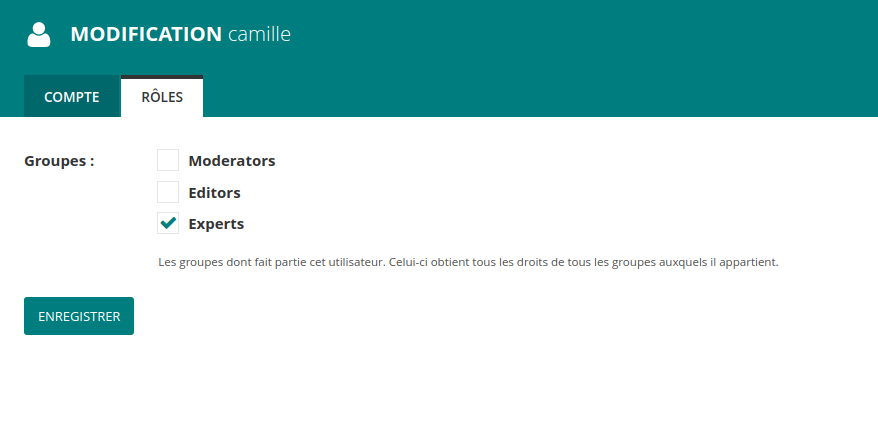
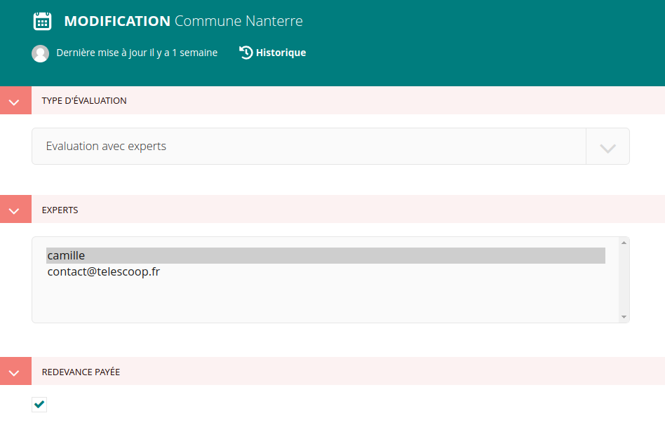

# Site de Démocratie Ouverte

## Vocabulaire

- Assessment : une évaluation, il y en a une par ville. Elles peuvent être de trois
types (AssessmentType) : Diagnostic rapide, Evaluation participative, Evaluation avec
expert
- Participation : une participation d'un utilisateur à une évaluation. Toutes les
réponses sont liées à une participation.
- ParticipationResponse : la réponse d'un utilisateur à une question. Comprend donc un
couple (réponse, participation).
- AssessmentResponse : une réponse à une question objective, qui est donc unique pour
une évaluation
- Question, Response : Question, Réponse, qui sont les questions du questionnaires et
les réponses possibles pour chaque question
  - une Question a un booléen `profiling_question` pour indiquer si c'est une question
  de profilage
  - QuestionnaireQuestion : ??
  - ProfilingQuestion : pourquoi à la fois ce modèle là et le booléen
  `profiling_question` ?
  - ResponseChoice : une réponse possible à une question
- Score : `associated_score` (pour l'affichage) entre 1 et 4 et `linearized_score`
(pour le calcul) entre 0 et 1.

## Calcul des scores

Les questions de profilage n'ont bien sûr pas de score.
Les scores sont compris entre 1 et 4 (sauf question booléenne). Ce score de 1 à 4 est converti entre 0 et 4 pour les calculs, avec des valeurs de 0, ⅓, ⅔ et 1\)
Les scores sont définis par type de question :

* Question booléenne : 0 si majoritairement non, \+1 point si majoritairement oui. Contrairement aux autres questions, c’est un point bonus.
  Exemple : les utilisateurs ont répondu
  * non : 3 réponses
  * oui : 5 réponses
    la réponse majoritaire est "oui", donc le point facultatif est attribué
* Question à choix unique : on fait la moyenne du score assigné à chaque réponse. La valeur possible d’une question est entre 1 et 4\.
  Exemple : les utilisateurs ont répondu
  * non : score associé 1, 4 réponse
  * plutôt non : score associé 2, 2 réponses
  * plutôt oui : score associé 3, 1 réponses
  * oui : score associé 4 : 5 réponses
    la moyenne est (4x1 \+ 2x2 \+ 3x1 \+ 5x4) / (4+2+1+5) \= 31 / 12 \= 2.58, arrondi visuellement à 3\.
* Question fermée à échelle : comme pour les questions à choix unique sauf que la moyenne des scores est faite pour chaque catégorie pour obtenir la moyenne de la question.
  Exemple : Vous trouvez que la mairie accompagne bien :
  * les adultes :
    * non : score associé 1, 4 réponse
    * plutôt non : score associé 2, 2 réponses
    * plutôt oui : score associé 3, 1 réponses
    * oui : score associé 4 : 5 réponses
      pour la catégorie adulte est 2.58
  * les enfants
    * non : score associé 1, 5 réponse
    * plutôt non : score associé 2, 1 réponses
    * plutôt oui : score associé 3, 1 réponses
    * oui : score associé 4 : 2 réponses
      pour les enfants, la moyenne de la catégorie enfant est 2

      La moyenne de la question est la moyenne entre 2 et 2.58, soit 2.29, visuellement arrondi à deux.

* Question pourcentage: on fait la moyenne des pourcentages obtenues et on récupère le score (entre 1 et 4\) défini par une plage correspondant à ce pourcentage.

Exemple :

* Réponses :
  * Utilisateur 1 répond 50%
    * Utilisateur 2 répond 100%

    On obtient une moyenne de 75%

  * Les plages :
    * entre 0 et 25 compris : score associé 1
    * entre 26 et 45 compris : score associé 2
    * entre 46 et 75 compris : score associé 3
    * entre 76 et 100 compris : score associé 4
  * Le score est de 3 car il correspond à la plage entre 46 et 75\.
* Question à choix multiple : On prend le score maximum pour chaque réponse et on fait la moyenne du score maximal obtenu par toutes les réponses de la question.
  Exemple : Quelle aide votre collectivité apporte-t-elle aux associations au-delà des subventions ?
  * Choix possibles :
    * Aucune: score associé 1
    * Du matériel : score associé 2
    * Des locaux : score associé 3
    * Un budget : score associé 4
  * Réponses :
    * Utilisateur 1 répond : Aucune (score maximum 1\)
    * Utilisateur 2 répond des locaux et un budget (score maximum 4\)
    * Utilisateur 3 répond du matériel et des locaux (score maximum 3\)
    * Utilisateur 4 répond un budget (score maximum 4\)
  * Le score est donc de (1 \+ 4 \+ 3 \+ 4\) / 4 \= 3
* Question nombre : On fait la moyenne des scores attribués à une plage de nombre. Pour l’instant ce type de question n’est disponible que pour les questions objectives. Il faudra maquetter un graphique et le développer pour pouvoir ajouter des questions nombres subjectives.
  Exemple :
  * Règle de la question
    * Pas de minimum (champ vide)
    * Maximum 2000
    * Granularité : 0.1 (au dixième près)

  * Les plages :
    * De \- Infini à 0 le score est de 1
    * De 0.1 à 100.5 le score est de 2
    * De 100.6 à 1000 le score est de 3
    * De 1000.1 à 2000 le score est de 4

    Comme on peut le remarquer, les plages dépendent de la granularité. Il faut donc commencer \+0.1 au-dessus pour prendre en compte toutes les possibilités de réponses : dans notre exemple la première borne termine à 0 l’autre borne doit donc commencer à 0.1.

  * Réponse :
    * Utilisateur 1 répond : 150 le score associé est de 3
    * Utilisateur 2 répond \-30 le score associé est de 1
  * Le score est de (3 \+ 1\) / 2 \= 2

### Score des piliers / marqueurs

Le score d'un marqueur est la moyenne des scores des questions, le score d'un pilier est la moyenne des scores des marqueurs. Chaque question a le même poids au sein d'un marqueur, chaque marqueur a le même poids au sein d'un pilier.
Pour le calcul d'un marqueur, le score questions booléennes sont considérées comme du bonus : il est inclus dans la moyenne mais pas dans le diviseur. Une question booléenne à score nul n'a donc pas d'impact sur la moyenne, une question booléenne à score de 1 augmente la moyenne.
Exemple :
Pour un marqueur on obtient le score suivant à chacune de ses questions :

- question booléenne avec un score de 1
- question choix unique avec un score de 3
- question pourcentage avec un score de 4
- question choix multiple avec un score de 4

Le score de ce marqueur sera de (1 \+ 3 \+ 4 \+ 4\) / 3 \= 4\. Sans la question booléenne, il aurait été de (3 \+ 4 \+ 4\) / 3 \= 3.66.

## Configuration du site

La configuration se fait depuis l'interface d'aministration, accessible à l'adresse :
`/admin/`.

### Catégorie des process participatifs

Les catégories des process participatifs sont définis comme étant les réponses possible
à la question du questionnaire (qui ne peut pas être une question de profilage) dont le
code est `7A`. Il est possible de les modifier depuis l'interface d'administration.

### Pages

### Questions
Les questions ne sont pas configurés comme des pages

### Partie expert
Afin de pouvoir la tester il y a plusieurs étapes (en effet seulement les experts associés à une évaluation doivent pouvoir avoir accès à cette partie là):
- Dans le backoffice : Paramètres > Utilisateurs > Rechercher l'utilisateur que l'on veut déclarer en tant qu'expert. Aller dans l'onglet Rôles et sélectionner la case Experts puis enregistrer. La personne est alors enregistrée comme étant un expert



- Dans le backoffice: Evaluations > Evaluation > Selectionner l'évaluation pour laquelle vous souhaitez ajouter un expert > Indiquez que c'est une évaluation avec experts + Selectionner l'expert dans la liste + indiquer que la redevance a été payée (sinon l'expert n'aura pas accès à cette évaluation) (NB : depuis le parcours utilisateur de la plateforme il est possible d'ajouter un expert, cependant il est possible de déclarer que la redevance a été payée seulement depuis l'admin wagtail)



Pour terminer : connectez-vous à la plateforme du DémoMètre avec le compte que vous avez déclaré comme étant expert, depuis la page du profile il y aura un bouton qui permet d'accéder à l'espace expert "Espace animateur".

## Pour les développeurs

### Lancer les tests E2E

#### Back

- lancer `E2E_TESTS=1 python manage.py migrate` si nécessaire (lorsque la BDD de test n'existe pas),
puis `E2E_TESTS=1 python manage.py e2e_populate_data` si nécessaire (lorsque des données de test ont changé).
- lancer `E2E_TESTS=1 python manage.py runserver` pour servir le front avec les données de test

#### Front

- lancer un `yarn run dev` dans un terminal
- lancer `yarn run cypress:open` pour lancer les tests

### Ajouter une langue

- ajouter la langue dans `settings/base.py`, dans les `WAGTAIL_CONTENT_LANGUAGES` et
`LOCALES_FOR_TRANSLATED_FIELDS`
- ajouter manuellement le champ Criteria.explanatory_{locale}
- ajouter manuellement le champ HomePage.international_block_countries.button_name_xx
- lancer `python manage.py makemigrations` (des champs sont ajoutés automatiquement dans les modèles via
le code de `open_democracy_back.apps.ready`)
- envoyer en (pré-)prod le nouveau code
- ajouter la langue dans les paramètres de wagtail
- ajouter la langue dans front/xx/localeSwitcher.vue:availableLocales
- redémarrer le service web (via supervisor) pour que les changements soient bien pris
en compte

### Ajouter des champs à traduire

- sur le modèle concerné, iniqué la liste des `translated_fields`
- lancer `makemigrations`
- modifier le fichier de migration, cf migraion 0056 pour
  - définir la fonction `fill_fr_fields`
  - définir les nouveaux champs à remplir par cette fonction
  - ajouter à la fin la migration `migrations.RunPython(fill_models_fr_fields, migrations.RunPython.noop),`

### Mettre à jour la base de donnée

    python manage.py makemigrations
    python manage.py migrate

### Mettre à jour l'index pour la fonction de recherche

To update the index and make work de search function :

```bash
python manage.py update_index
```


### Mettre à jour les traductions :

- Créer ou mettre à jour un fichier de traductions :
    `django-admin makemessages -l fr`
- Renseigner à la main les traductions dans les fichiers .po autogénéré
- Compiler les fichiers de traductions:
    `django-admin compilemessages`

### Utilisation de l'app django Tweets

Cf le README correspondant à l'app Tweets


### Système de traduction utilisé

Le système de traduction utilisé est [wagtail-localize](https://www.wagtail-localize.org/)
> Attention : Si une langue est rajouté il faudra (en plus du système de base de wagtail localize) adapter le switch de langue du header


### Commit de suppression des questions avec classement

https://gitlab.com/telescoop/democratie-ouverte/back/-/commit/7a901bffae7f54ead328b4d84819fa2716b1786b
