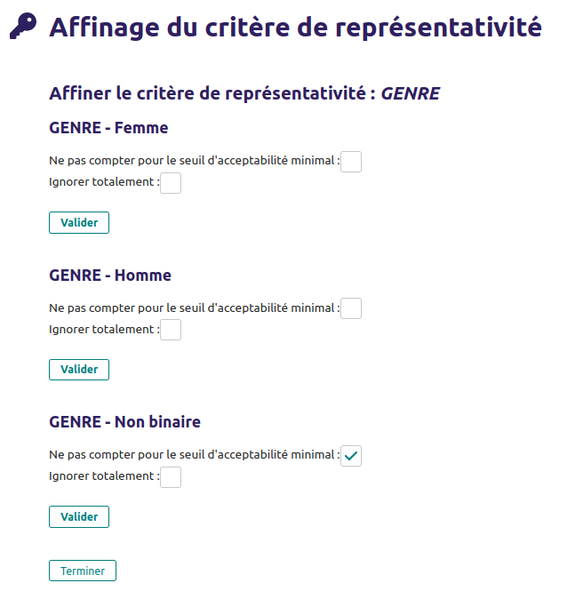

# Documentation du Démomètre

## Le Démomètre en quelques mots

La plateforme du démomètre est constituée de deux logiques métiers :
* 📢 une partie *blog* permettant de communiquer : articles de blog, modifications de la page d’accueil, etc.
* 📝 des *évaluations* pour évaluer la démocratie.

Mettons de côté la partie *blog* pour nous concentrer sur la partie *évaluation*.

Les différents concepts de la plateforme sont :
* les **évaluations** ;
* les **participations** ;
* les **questionnaires** (incluant les questions, piliers, marqueurs et critères) : il s'agit des questions qui doivent être posées dans une évaluation. Ces questions sont structurées de manière à rendre les résultats intelligibles.
* les **profils**
* les **rôles** :

Tout est rendu plus clair (ou moins clair ?) par des codes.

👉 Comment traduire la plateforme ? [traduction](/docs/traduction.md)

### Les questionnaires

* les **questionnaires** (`Survey` dans le code) : il s'agit de l'ensemble des piliers, marqueurs et questions qui vont être évalués pour un échelon donné. Il y donc au plus quatre questionnaires (un pour chaque échelon : ville, epci, département et région) ;
* les **piliers** (`Pillar` dans le code) : la démocratie est évaluée sur le démomètre selon quatre piliers de « représentation », de « transparence », de « participation » et de « coopération ». Concrètement, il faut définir les quatre piliers pour chaque questionnaire.
* les ***marqueurs** (`Marker` dans le code) : il s'agit d'un indicateur global associé à un pilier. Cet indicateur obtiendra une valeur chiffrée entre 1 et 4 qu'il convient d'expliciter. Par exemple le marqueur « Tissu associatif et militant » permet d'évaluer le pilier de la « coopération » et s'il a la valeur 1 cela signifie qu'il y  a un « faible nombre de corps intermédiaires et soutien de la collectivité ; tensions observées ».
* les **critères** (`Criteria` dans le code) : associés à un marqueur,il s'agit de ce qu'on souhaite mesurer à l'une d'une ou plusieurs questions au sein de ce marqueur ;
* les **questions** (`Question` dans le code) : c'est la question posée à l'utilisateur·ice. Cette dernière est associée à un critère (et dans les faits, il y a souvent une seule question par critère). Ces questions peuvent être de nombreux types différents (en particulier à choix unique, multiple, fermée à échelle, en pourcentage, etc.). On peut les restreindre à certains profils ou rôles, etc.

### Les profilages

* la **représentativité** : associée à un questionnaire (exactement à un échelon) et à une unique question de profilage, elle permet de définir un seuil minimal en dessous du-quel la publication des résultats est interdite ;
* les **types de profils** : ils permettent de classer les répondants en fonction des réponses aux questions de profilage. Par exemple on a le rôle « non résident » si on répond « je ne réside pas sur le territoire » à la question « Quartier de résidence » (en cas de questionnaire communal) ou si on répond « je ne réside pas sur le territoire » à la question « lieu de résidence REGION ».
* les **questions de profilage** sont des **questions** *presque* comme les autres à la différence principale qu’elle n’est pas associée à un critère mais potentiellement à plusieurs questionnaires.

### Les évaluations

Il existe trois types d'évaluation :

- évaluation participative, avec ou sans expert
- évaluation rapide

#### Cycles de vie
Pour les **évaluations participatives**, une seule évaluation peut être faite par collectivité en même temps.
Concrètement, si l'utilisateur U1 initie une évaluation sur la ville de Paris, un utilisateur U2 ne peut que rejoindre l'évaluation initiée par U1.
MAQ: qui peut initier ?

Les évaluations rapides sont faites par et pour un utilisateur uniquement. Elles n'impactent donc pas les autres évaluations d'autres utilisateurs.

Attention tout de même : si une évaluation participative est en cours pour une ville, il n'est plus possible d'y lancer une évaluation rapide.
Dans l'autre sens, il est donc par contre possible de lancer une évaluation participative pour une collectivité qui a déjà une ou plusieurs évaluations rapides effectuées.

Une évaluation est considérée en cours jusqu'à ce qu'elle soit clôturée.

Une évaluation peut être clôturée par un expert ou par l'initiateur.

### Process participatifs

MAQ. C’est juste un type de question je crois.

#### Définir les process participatifs

Auparavant, pour les questions qui concernaient les process participatifs, il était difficile d'interpréter les réponses s'il y avait plusieurs process participatifs pour la ville. Ça posait également des questions pour les participants : comment dois-je répondre à la question de savoir si j'ai été écouté lors des process participatifs si j'ai participé à plusieurs et que j'ai
des avis différents ?

Lors de l'initiation d'une évaluation (et uniquement lors de l'évaluation), il est maintenant possible de définir des process participatifs pour la collectivité évaluée. Les process participatifs sont associées à des catégories process participatifs, qui sont les réponses possibles à la Question de profilage dont le code est "7A". Pour les modifier, aller donc dans le back-office, onglet Profilage puis Questions de profilage. ⚠️ Les modifications doivent être limitées et dans la mesure du possible ne pas supprimer des options, il risque sinon d'y avoir une perte d'informations des process participatifs déjà reliées à des réponses.

Un renommage d'une réponse est possible, si ça ne change pas le sens (au risque de mal interpréter les réponses).

Cette étape intervient juste après avoir défini au nom de qui l'évaluation est lancée, avant les questions objectives.

Si des process participatifs sont définis pour une évaluation, les participants peuvent indiquer les
process auxquels iels ont participé lors des questions de profilage.

#### Les questions qui concernent les process participatifs

Dans l'admin, on peut définir les questions qui concernent les process participatifs, en cochant
simplement la case correspondantes dans l'édition des questions.

En tant que participant, quand je réponds aux questions, si une questions concerne un process
participatif et que j'ai indiqué avoir participé à plusieurs process participatifs, je réponds
alors plusieurs fois à la question, une fois par process participatif.

Lorsque je visualise les résultats, je peux sélectionner le ou les process participatifs pour
lesquels je souhaite visualiser les résultats.

### Seuils de représentativité

Les seuils de représentativité servent à déterminer quand une évaluation peut être publiée : c'est le cas lorsque tous les seuils de représentativité sont respectés.

Par exemple, si j'ai configuré pour le seuil de représentativité "Genre" 35% pour Femme et 35% pour Homme, l'évaluation ne peut être publiée que si au moins 35% des participants ont répondu Femme à la question de profilage ET que au moins 35% des participants ont répondu Homme à la question de profilage.

#### Modifier les seuils pour une évaluation

Ces seuils peuvent être configuré par l'initiateur, dans la page d'une évaluation
(accessible depuis Mon Compte -> Mes Évaluations -> cliquer sur l'évaluation).

Les chiffres indiqués en gris sont les valeurs par défaut (configurable dans l'admin).
Je peux modifier chacun des seuils. Un seuil est ignoré s'il est rempli à zéro.
Pour rétablir la valeur par défaut, cliquer sur la croix à côté de celui-ci.

#### Modifier globalement les seuils

Dans l'interface admin, les seuils peuvent être modifié en cliquant depuis le menu de gauche sur Représentativité.

De manière globale, on ne peut définir qu'un seuil par question de profilage, sans pouvoir différencier. Par exemple pour les catégories socio-professionnelles, la même valeur choisie s'appliquera à chacune des catégories socio-professionnelle définie. Comme décrit plus haut, cela peut cependant être affiné par évaluation.

Si certains réponses sont peu courantes, on peut toutefois les exclure des critères de représentativité. Sur l'image plus haut, cliquer sur le bouton "Affiner le critère de représentativité".

- Ne pas compter pour le seuil d'acceptabilité minimal : signifie que ce critère est affiché dans le tableau
de bord d'une évaluation, mais ignoré pour le calcul du seuil d'acceptabilité minimal.

- Ignorer totalement : signifie que cette réponse est également ignorée pour le calcul du seuil d'acceptabilité
minimal, mais également que la réponse n'est pas affichée dans le tableau de bord. Également, les réponses
correspondantes ne sont pas prises en compte dans les calculs. Si je coche cette case pour Non binaire, et que
10 personnes ont répondu Femme, 10 personnes ont répondu Homme et 5 personnes Non binaire, le tableau de bord
affichera 50%/50% (et non 40%/40%)

### Générer un questionnaire papier

Note : seuls les utilisateurs administrateurs ou experts peuvent générer un questionnaire papier.

Pour cela, une fois connecté, se rendre dans la page Mon Compte.

Il suffit alors de cliquer sur le bouton "Générer un questionnaire papier en fonction d'un profil",
puis de choisir le profil. On arrive alors sur une page affichant toutes les questions en précisant
les profils concernés.

La page peut alors être imprimée avec le navigateur.

### Ateliers et saisir des réponses papier

En tant qu'initiateur d'une évaluation, on peut ajouter des ateliers.

Depuis la page d'une évaluation (Mon Compte -> Évaluations -> Mon évaluation), une rubrique
"Mes ateliers" est présente. On peut ajouter ou modifier des ateliers.

Depuis la page d'un atelier (cliquer dessus depuis la liste pour y accéder), on peut modifier les
informations et saisir des réponses papier.

Pour saisir des réponses papier, il faut d'abord saisir des participants, et indiquer donc qu'ils
ont répondu "Sur papier".

Une fois les participants saisis, cliquer sur "Saisir les réponses papier". On peut répondre ensuite
à chaque question, une fois par participant.

