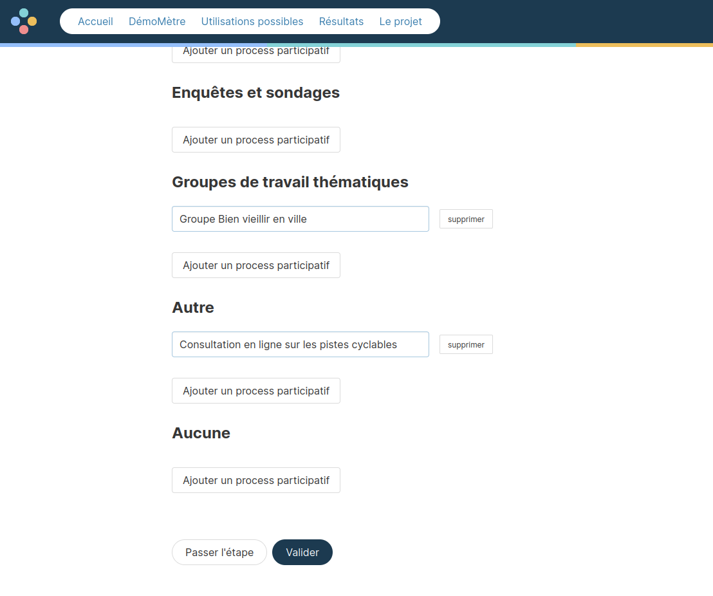
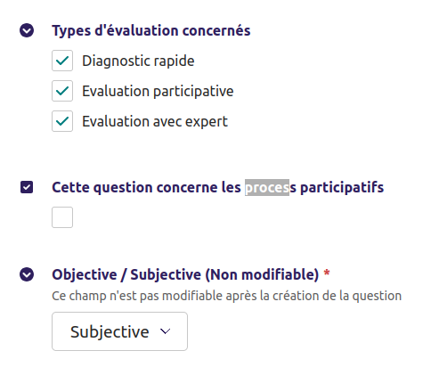

# Process participatifs

Un **process participatif** correspond à une manière d'impliquer les citoyens sur un territoire. Il peut s'agir de consultations ou de budgets participatifs par exemple.

## Définir les process participatifs

Auparavant, pour les questions qui concernaient les process participatifs, il était difficile d'interpréter les réponses s'il y avait plusieurs process participatifs pour la ville. Ça posait également des questions pour les participants : comment dois-je répondre à la question de savoir si j'ai été écouté lors des process participatifs si j'ai participé à plusieurs et que j'ai des avis différents ?

**Désormais**, les questions relatives aux process participatifs sont posées autant de fois qu'il y a de process participatifs en place sur la commune.

Lors de l'initiation d'une évaluation (et uniquement lors de l'évaluation), il est maintenant possible de définir des process participatifs pour la collectivité évaluée. Les process participatifs sont associées à des catégories process participatifs, qui sont les réponses possibles à la Question de profilage dont le code est "7A". Pour les modifier, aller donc dans le back-office, onglet Profilage puis Questions de profilage. ⚠️ Les modifications doivent être limitées et dans la mesure du possible ne pas supprimer des options, il risque sinon d'y avoir une perte d'informations des process participatifs déjà reliées à des réponses.

Un renommage d'une réponse est possible, si ça ne change pas le sens (au risque de mal interpréter les réponses).

Cette étape intervient juste après avoir défini au nom de qui l'évaluation est lancée, avant les questions objectives.

Si des process participatifs sont définis pour une évaluation, les participants peuvent indiquer les
process auxquels iels ont participé lors des questions de profilage.

## Les questions qui concernent les process participatifs

Dans l'admin, on peut définir les questions qui concernent les process participatifs, en cochant
simplement la case correspondantes dans l'édition des questions.

En tant que participant, quand je réponds aux questions, si une questions concerne un process
participatif et que j'ai indiqué avoir participé à plusieurs process participatifs, je réponds
alors plusieurs fois à la question, une fois par process participatif.

Lorsque je visualise les résultats, je peux sélectionner le ou les process participatifs pour
lesquels je souhaite visualiser les résultats.