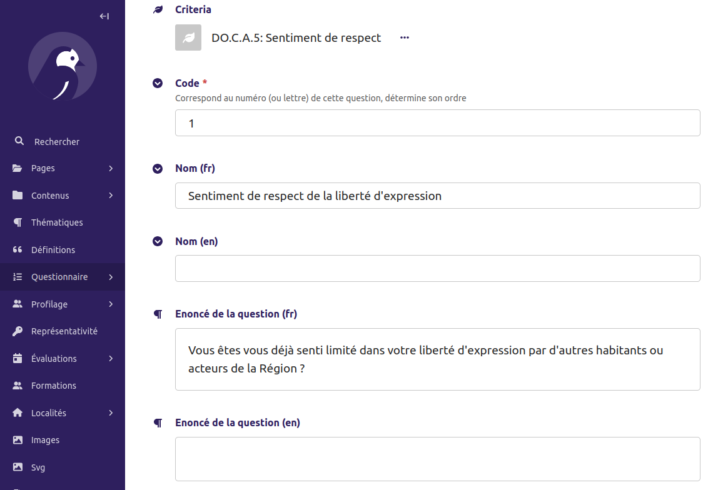

# 🇫🇷 🇬🇧 Traduire le Démomètre

Le démomètre peut notamment être traduit en anglais. Tout le contenu modifiable (questionnaire, pages du site, etc.) est traduisible directement dans l'interface d'administration tandis que les traductions structurels (boutons de navigation, bas de page, etc.) doivent être traduits directement dans le code.

Cette page décrit comment réaliser ces modifications

## Traductions du contenu via l'interface d'administration

### Questionnaire

Pour les éléments du questionnaire (Pillier / Marqueur / Critère / Question),
tous les textes présents sont présents dans toutes les langues, les un en-dessous des autres.

Par exemple ici, pour l'énoncé de la question :

C'est ailleurs dans le menu, mais cela fonctionne de la même manière pour les
rôles / type de profil / question de profilage / retour d'expérience / ressource.

### Pages du site

Les pages du sites sont structurées de manière hiérarchique, la page "parent" principale étant la page d'accueil de la langue correspondante.

Pour modifier la page d'accueil de la langue, cliquer sur le 🖊️ crayon à droite.
Pour visualiser les pages enfants, cliquer sur la flèche à droite.

Les pages "enfants" peuvent ensuite être modifiées en cliquant aussi sur le crayon 🖊️.

### Articles de blog

Les articles sont indépendants dans chaque langue. On peut créer un article uniquement en anglais,
ou uniquement en français, ou un article équivalent dans les deux langues.

Pour n'afficher que les articles dans une langue, un filtre existe sur la droite.

## Éléments web traduisibles par fichier de traduction

De nombreux éléments web ne sont pas traduisibles dans l'interface d'administration,
par exemple les boutons de navigation, du bas de page, des boutons "suivant" ou "précédent"...

Il est nécessaire de demander ces modifications aux développeur·euses.
Concrètement, iels vont modifier [ce fichier](/back/locale/en/LC_MESSAGES/django.po).

> ℹ️ Au début du projet, ils étaient traduisibles dans une interface en ligne mais ce logiciel étant désormais payant.

## Ajouter une nouvelle langue

Ajouter une nouvelle langue demande une intervention de la part des développeureuses,
de l'ordre d'une journée de travail.
Cf [Documentation back-end](/back/README.md#ajouter-une-langue) pour la partie technique.
