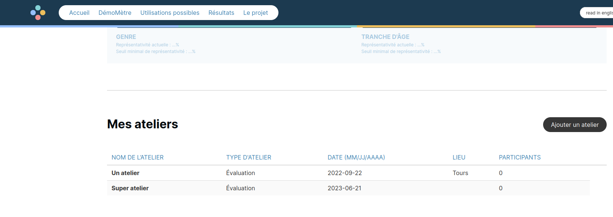
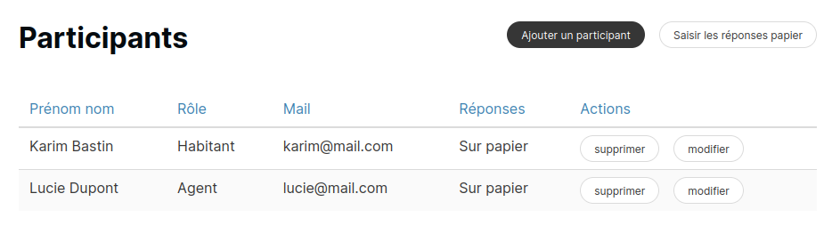

# Usages pratiques du Démomètre

## Questionnaires papiers

### Générer un questionnaire papier

Note : seuls les utilisateurs administrateurs ou experts peuvent générer un questionnaire papier.

Pour cela, une fois connecté, se rendre dans la page Mon Compte.

Il suffit alors de cliquer sur le bouton "Générer un questionnaire papier en fonction d'un profil",
puis de choisir le profil. On arrive alors sur une page affichant toutes les questions en précisant
les profils concernés.

La page peut alors être imprimée avec le navigateur.

### Ateliers et saisir des réponses papier

En tant qu'initiateur d'une évaluation, on peut ajouter des ateliers.

Depuis la page d'une évaluation (Mon Compte -> Évaluations -> Mon évaluation), une rubrique
"Mes ateliers" est présente. On peut ajouter ou modifier des ateliers.

Depuis la page d'un atelier (cliquer dessus depuis la liste pour y accéder), on peut modifier les
informations et saisir des réponses papier.

Pour saisir des réponses papier, il faut d'abord saisir des participants, et indiquer donc qu'ils
ont répondu "Sur papier".

Une fois les participants saisis, cliquer sur "Saisir les réponses papier". On peut répondre ensuite
à chaque question, une fois par participant.

